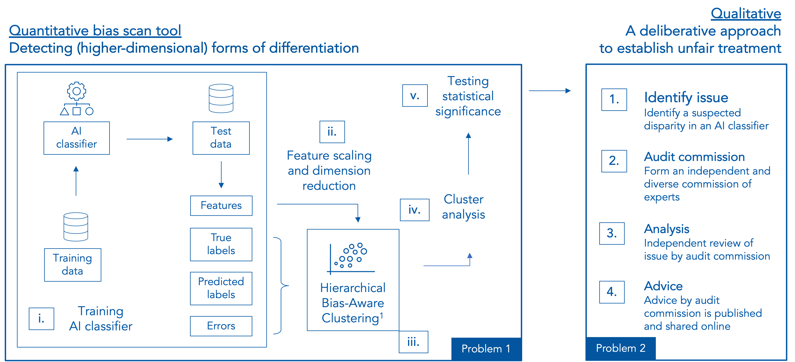
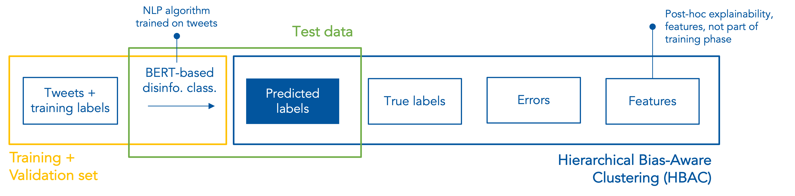

# Unsupervised bias scan tool
## A quantitative method to inform qualitative bias testing 

☁️ The bias scan tool is available as a web application: https://www.algorithmaudit.eu/bias_scan/. 

📊 Main presentation: [slides](https://github.com/NGO-Algorithm-Audit/Bias_scan/blob/master/Main_Presentation_Unsupervised_bias_scan.pdf).

📄 Technical documentation: [report](https://github.com/NGO-Algorithm-Audit/Bias_scan/blob/master/Bias_scan_tool_report.pdf).

## Key takeaways – Why this approach?
- **Bias scan tool**: Quantitative method to _detect_ higher- and lower-dimensional forms of algorithmic differentiation;
- **Unsupervised bias detection**: No user data needed on protected attributes; 
- **Model-agnostic**: Works for all binary AI classifiers; 
- **Audit commission**: Qualitative, expert-led approach to _establish_ unfair treatment;
- **Open-source and not-for-profit**: Available for the entire AI Audit community.

## Solution overview


## Executive summary
Artificial intelligence (AI) is increasingly used to automate or support policy decisions that affects individuals and groups. It is imperative that AI adheres to the legal and ethical requirements that apply to such policy decisions. In particular, policy decisions should not be systematically discriminatory (direct or indirect) with respect to protected attributes such as gender, sex, ethnicity or race.

To achieve this, we propose a scalable, model-agnostic, and open-source bias scan tool to identify potentially discriminated groups of similar users in binary AI classifiers. This bias scan tool does not require *a priori* information about existing disparities and protected attributes, and is therefore able to detect possible proxy discrimination, intersectional discrimination and other types of differentiation that evade non-discrimination law. The tool is available as a web application, available on the [website](https://www.algorithmaudit.eu/bias_scan/) of Algorithm Audit, such that it can be used by a wide public.

As demonstrated on a BERT-based Twitter disinformation detection model, the bias scan tool identifies statistically significant disinformation classification bias against [...].

These observations do not establish prohibited *prima facie* discrimination. Rather, the identified disparities serve as a starting point to assess potential discrimination according to the context-sensitive legal doctrine, i.e., assessment of the legitimacy of the aim pursued and whether the means of achieving that aim are appropriate and necessary. For this qualitative assessment, we propose an expert-oriented deliberative method. Which allows policy makers, journalist, data subjects and other stakeholders to publicly review identified quantitative disparities against the requirements of non-discrimination law and ethics. In our two-pronged quantitative-qualitative solution, scalable statistical methods work in tandem with the normative capabilities of human subject matter experts to define fair AI on a case-by-case basis (see the solution overview Figure below). 

<sub>**Note**: The implemented bias scan tool is based on the k-means Hierarchical Bias-Aware Clustering (HBAC) method as described in Misztal-Radecka, Indurkya, *Information Processing and Management*. Bias-Aware Hierarchical Clustering for detecting the discriminated groups of users in recommendation systems (2021). Additional research indicates that k-means HBAC, in comparison to other clustering algorithms, works best to detect bias in real-world datasets.</sub>

## Input data bias scan tool
A .csv file of max. 1GB, with columns structured as follows: features, predicted labels, truth labels. Only the order, not the naming, of the columns is important.

- **Features**: unscaled numeric values, e.g., *feat_1, feat_2, ..., feat_n;*
- **Predicted label**: 0 or 1;
- **Truth label**: 0 or 1.

| feat_1 | feat_2 | ... | feat_n | pred_label | truth_label |
|--------|--------|-----|--------|------------|-------------|
| 10     | 1      | ... | 0.1    | 1          | 1           |
| 20     | 2      | ... | 0.2    | 1          | 0           |
| 30     | 3      | ... | 0.3    | 0          | 0           |

The tool is available as a web application on the [website](https://www.algorithmaudit.eu/bias_scan/) of Algorithm Audit.

## Case study – BERT-based disinformation classifier (Twitter1516 data set)
A BERT-based disinformation classifier is trained on true and false tweets (n=1,057) from the Twitter1516 data set. For this dataset, user and content features are [collected](https://github.com/NGO-Algorithm-Audit/Bias_scan/blob/master/data/Twitter_dataset/Twitter_API_data_collection.ipynb) from the Twitter API. More details on the training process of the BERT-based disinformation classifier can be found [here](https://github.com/NGO-Algorithm-Audit/Bias_scan/blob/master/classifiers/BERT_disinformation_classifier/BERT_Twitter_classifier.ipynb). 
### Bias scan pipeline


### Results: False Positive Rate (FPR) bias metric
For this bias scan, bias is defined by the False Positive Rate (FPR) per cluster. That is: 

_Bias = FPR(cluster) - FPR(rest of dataset)_. 

A False Positives (FP) means that true content is classified as disinfo by the AI classifier. The cluster with highest bias deviates 0.08 from the rest of the data set. There are 249 tweets in this cluster.


In this cluster, users with:
- above average verified profiles, #followers, user engagement, #URLs
- below average #hashags, tweet length

face on average more FP classifications.

This is the full list of statistical significant differences in (feature) means between the cluster with most bias (0.08) and rest of dataset:
| feature          | difference | p-value |
|------------------|------------|---------|
| verified         | 1.419      | 0.000   |
| #followers       | 0.777      | 0.000   |
| user_engagement  | 0.878      | 0.000   |
| #URLs            | 1.130      | 0.000   |
| #mentions        | -0.193     | 0.064   |
| #hashs           | -0.634     | 0.000   |
| length           | -0.669     | 0.000   |
| #sentiment_score | 0.167      | 0.115   |

More details on this case study can be found [here](https://github.com/NGO-Algorithm-Audit/Bias_scan/blob/master/HBAC_scan/HBAC_BERT_disinformation_classifier.ipynb). 

### Results: False Negative Rate (FNR) bias metric
For this bias scan, bias is defined by the False Negative Rate (FPR) per cluster. That is: 

_Bias = FNR(cluster) - FNR(rest of dataset)_. 

A False Negative (FN) means that disinformation is classified as true content by the AI classifier. The cluster with highest bias deviates 0.13 from the rest of the data set. There are 46 tweets in this cluster.


In this cluster, users with:
- above average #hashtags, sentiment score;
- below average verified profile, #followers, user engagement and tweet length

face on average more FN classifications.


This is the full list of statistical significant differences in (feature) means between the cluster with most bias (0.13) and rest of dataset:
| feature          | difference | p-value |
|------------------|------------|---------|
| verified         | -1.965     | 0.000   |
| #followers       | -0.575     | 0.000   |
| user_engagement  | -0.619     | 0.000   |
| #URLs            | -0.080     | 0.607   |
| #mentions        | -0.086     | 0.465   |
| #hashs           | 0.588      | 0.005   |
| length           | -0.702     | 0.000   |
| #sentiment_score | 0.917      | 0.000   |

More details on this case study can be found [here](https://github.com/NGO-Algorithm-Audit/Bias_scan/blob/master/HBAC_scan/HBAC_BERT_disinformation_classifier.ipynb).  

### Conclusion
The identified quantitative disparities are submitted to an audit commission, existing of AI experts with a wide range of professional background. The problem statement proposed to commission member can be found here. The advice of the commission will shape the conclusion of this case study, i.e., whether the identified disparities might indicate unfair treatment or not.

### Structure of this repository
```
    .
    ├── HBAC_scan                                               # Unsupervised bias scan (quantitative)
    ├── audit_commission                                        # commission materials
    ├── classifiers                                             # Self-trained binary AI classifiers
    ├── data                                                    # Twitter1516 and German Credit data
    ├── images                                                  # Images
    ├── literature                                              # Reference materials
    ├── .gitattributes                                          # To store large files
    ├── .gitignore                                              # Files to be ignored in this repo
    ├── LICENSE                                                 # MIT license for sharing 
    ├── Main_Presentation_Bias_scan.pdf                         # Main presentation
    ├── README.md                                               # ReadMe file 
    └── Technical_Documentation_Bias_scan.docx                  # Techical documentation
```

## Contributors to this project:
- Jurriaan Parie, Trustworthy AI consultant at Deloitte;
- Ariën Voogt, PhD-candidate in Philosophy at Protestant Theological University of Amsterdam;
- Joel Persson, PhD-candidate in Applied Data Science at ETH Zürich;
- dr. Vahid Niamadpour, PhD-candidate in Linguistics at Leiden University;
- Floris Holstege, PhD-candidate in Explanable Machine Learning at University of Amsterdam.

## This project is endorsed by:
- Gabriel Geiger, Investigative Reporter Algorithms and Automated Decision-Making at Lighthouse Reports;
- Marlies van Eck, Assistant Professor at Radboud University;
- Laurens van der Maas, Data Scientist at AWS;
- Simone Maria Parazzoli, Intern at the OECD Observatory of Public Sector Innovation (OPSI).