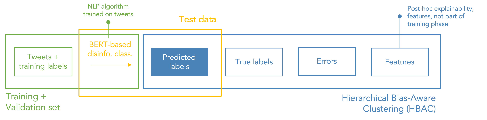
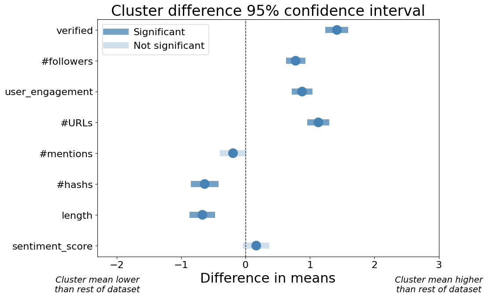
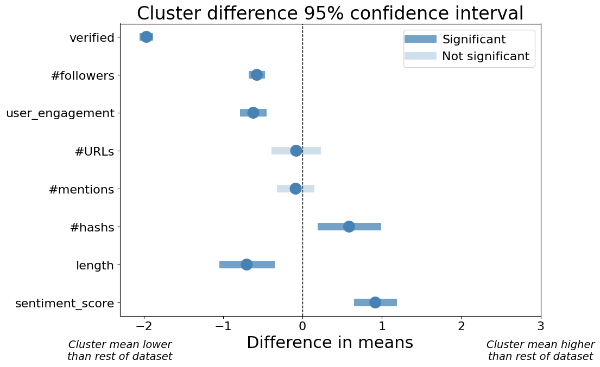

# Unsupervised bias scan tool and case repository
## A quantitative method to inform qualitative bias testing 

☁️ The bias scan tool is available as a web application: https://www.algorithmaudit.eu/bias_scan/. 

⚖️ Algorithm Audit's case repository: https://www.algorithmaudit.eu/cases/.

📊 Main presentation: [slides](https://github.com/NGO-Algorithm-Audit/Bias_scan/blob/master/Main_presentation_bias_scan.pdf).

📄 Technical documentation: [report](https://github.com/NGO-Algorithm-Audit/Bias_scan/blob/master/Technical_documentation_bias_scan.pdf).

## Key takeaways – Why this approach?
- **Bias scan tool**: Quantitative method to _detect_ higher- and lower-dimensional forms of algorithmic differentiation;
- **Unsupervised bias detection**: No user data needed on protected attributes; 
- **Model-agnostic**: Works for all binary AI classifiers; 
- **Audit commission**: Qualitative, expert-led approach to _establish_ unfair treatment;
- **Case repository**: Over time a case repository emerges from which data scientists and public authorities can distill ‘techno-ethical’ best-practices;
- **Open-source and not-for-profit**: Available for the entire AI auditing community.

## Solution overview
_Problem 1_: The human mind is not equipped to detect higher-dimensional forms of algorithmic differentiation.

_Problem 2_: If differentiation is detected, a persistent gap remains between quantitative fairness metrics and qualitative interpretation

<sub>*Figure 1 – Quantitative-qualitative solution overview*</sub>

## Executive summary
As AI is more commonly used to make or support policy and business decisions, it is essential that it follows legal and ethical guidelines. It is especially important to prevent unfair bias in these decisions. Unfair bias can come from differentiating people based on protected attributes, such as gender, sexual orientation, or race, i.e. by way of direct or indirect discrimination. Unfair differentiation can also occur in relation to new categories of people (defined by a high-dimensional mixture of features), which are not covered by anti-discrimination law. Such new types of differentiation could be perceived as unfair, if for instance it reinforces socio-economic inequality. Yet it is often difficult to detect and mitigate such higher-dimensional forms of bias.

To address this challenge, we propose a scalable, model-agnostic, and open-source bias scan tool, which is able to identify groups of similar users (called ‘clusters’) that are potentially treated unfairly by a binary AI classifier. This bias scan tool does not require _a priori_ information about existing disparities and protected attributes. It is therefore able to detect possible proxy discrimination, intersectional discrimination and other types of (higher-dimensional) unfair differentiation. The tool is available as a web application on the [website](https://www.algorithmaudit.eu/bias_scan/) of Algorithm Audit, so that it may be freely used by the entire AI auditing community.

We tested our bias scan tool on a BERT-based disinformation detection model, which is trained on the widely cited Twitter1516 data set. Our bias scan identifies a statistically significant bias against a cluster of similar users (characterized by a verified profile, higher number of followers and higher user engagement score). This cluster of users on average faces more true content being classified as false (false positives). We also find a bias in respect of another cluster of users, of whom false content is more often classified as true (false negatives). These results are supported by sensitivity testing for 162 reasonable hyperparameter configurations of the unsupervised bias scan tool. Resulting in 1,000+ clusters, which aggregation statistics confirm our findings.

These observations do not establish prohibited _prima facie_ discrimination. Rather, the identified disparities serve as a starting point for evaluating the possibility of unfair treatment in a qualitative way, which takes into account the particular context and the relevant legal doctrines. For this qualitative assessment, we propose an expert-led deliberation method. This approach is commonly used by Algorithm Audit to provide ethical guidance on issues that arise when using algorithmic methods. For this particular test case, we formulate a set of pressing questions about the disinformation classifier performance and present these questions to an independent audit commission of AI experts. Building on the quantitative results of the bias scan, these experts provide qualitative justifications to make a normative judgment about whether the classifier is causing unfair treatment or not.

All documentation relating to this and other case studies is publicly available in our [case repository](https://www.algorithmaudit.eu/cases/). In this way, we enable policy makers, journalists, data subjects and other stakeholders to review the normative judgements issued by the audit commissions of Algorithm Audit. In our two-pronged solution to algorithmic bias, the quantitative and scalable methods of statistical testing work in tandem with the normative judgment of human experts, in order to determine fair AI on a case-by-case basis (see Figure 1).

<sub>**Note**: The implemented bias scan tool is based on the k-means Hierarchical Bias-Aware Clustering (HBAC) method as described in Misztal-Radecka, Indurkya, *Information Processing and Management*. Bias-Aware Hierarchical Clustering for detecting the discriminated groups of users in recommendation systems (2021). Additional research indicates that k-means HBAC, in comparison to other clustering algorithms, works best to detect bias in real-world datasets.</sub>

## Input data bias scan tool
☁️ The tool is available as a web application on the [website](https://www.algorithmaudit.eu/bias_scan/) of Algorithm Audit.

A .csv file of max. 1GB, with columns structured as follows: features, predicted labels, truth labels. Only the order, not the naming, of the columns is important.

- **Features**: unscaled numeric values, e.g., *feat_1, feat_2, ..., feat_n;*
- **Predicted label**: 0 or 1;
- **Truth label**: 0 or 1.

| feat_1 | feat_2 | ... | feat_n | pred_label | truth_label |
|--------|--------|-----|--------|------------|-------------|
| 10     | 1      | ... | 0.1    | 1          | 1           |
| 20     | 2      | ... | 0.2    | 1          | 0           |
| 30     | 3      | ... | 0.3    | 0          | 0           |

<sub>*Table 1 – Structure of input data in the bias scan web application*</sub>

## Case study – BERT disinformation classifier (Twitter1516 data set)
We use the unsupervised bias scan tool to assess fair treatment of a self-trained disinformation detection algorithm on the Twitter1516 dataset. Below, statistically significant disparities found by the tool are presented. Based on these quantitative results, questions are distilled and submitted to an audit commission consiting of AI experts. This audit commission formulates a normative advice if, and how, (higher-dimensional) unfair treatment can be assessed on the basis of the bias scan results.

### Bias scan pipeline
A BERT disinformation classifier is trained on true and false tweets (n=1,057) from the [Twitter1516](https://www.dropbox.com/s/7ewzdrbelpmrnxu/rumdetect2017.zip?dl=0&file_subpath=%2Frumor_detection_acl2017) dataset. For this dataset, user and content features are [collected](https://github.com/NGO-Algorithm-Audit/Bias_scan/blob/master/data/Twitter_dataset/Twitter_API_data_collection.ipynb) from the Twitter API. 

📑 More details on the training process of the BERT disinformation classifier can be found [here](https://github.com/NGO-Algorithm-Audit/Bias_scan/blob/master/classifiers/BERT_disinformation_classifier/BERT_Twitter_classifier.ipynb). 


<sub>*Figure 2 – Bias scan pipeline for the disinformation classifier case study*</sub>

### Results: False Positive Rate (FPR) bias metric
For this bias scan, bias is defined by the False Positive Rate (FPR) per cluster. That is: 

_Bias = FPR(cluster) - FPR(rest of dataset)_. 

A False Positive (FP) means that true content is classified as disinformation by the AI classifier. The cluster with highest bias deviates 0.08 from the rest of the data set. There are 249 tweets in this cluster.

<sub>*Figure 3 – Bias scan results for FPR bias scan. Features with dark blue confidence intervals that do not hit the x=0 line indicate statistically significant difference in feature means between the cluster with highest bias and the rest of the dataset.*</sub>

On average, users that:
- are verified, have higher #followers, user engagement and #URLs;
- use less #hashags and have lower tweet length

have more true content classified as false (false positives).

<!-- This is the full list of statistical significant differences in (feature) means between the cluster with most bias (0.08) and rest of dataset:
| feature          | difference | p-value |
|------------------|------------|---------|
| verified         | 1.419      | 0.000   |
| #followers       | 0.777      | 0.000   |
| user_engagement  | 0.878      | 0.000   |
| #URLs            | 1.130      | 0.000   |
| #mentions        | -0.193     | 0.064   |
| #hashs           | -0.634     | 0.000   |
| length           | -0.669     | 0.000   |
| #sentiment_score | 0.167      | 0.115   |

*Table 2 – Bias scan results for FPR scan. A p-values below 0.05 indicates statistically significant difference in feature means between the cluster with highest bias and the rest of the dataset.* -->

📑 More details on this case study can be found [here](https://github.com/NGO-Algorithm-Audit/Bias_scan/blob/master/HBAC_scan/HBAC_BERT_disinformation_classifier.ipynb). 

### Results: False Negative Rate (FNR) bias metric
For this bias scan, bias is defined by the False Negative Rate (FNR) per cluster. That is: 

_Bias = FNR(cluster) - FNR(rest of dataset)_. 

A False Negative (FN) means that disinformation is classified as true by the AI classifier. The cluster with highest bias deviates 0.13 from the rest of the data set. There are 46 tweets in this cluster.

<sub>*Figure 4 – Bias scan results for FNR bias scan. Features with dark blue confidence intervals that do not hit the x=0 line indicate statistically significant difference in feature means between the cluster with highest bias and the rest of the dataset.*</sub>

On average, users that:
- use more #hashtags and have higher sentiment score;
- are non-verified, have less #followers, user engagement and tweet length

have more false content classified as true (false negatives).

<!-- This is the full list of statistical significant differences in (feature) means between the cluster with most bias (0.13) and rest of dataset:
| feature          | difference | p-value |
|------------------|------------|---------|
| verified         | -1.965     | 0.000   |
| #followers       | -0.575     | 0.000   |
| user_engagement  | -0.619     | 0.000   |
| #URLs            | -0.080     | 0.607   |
| #mentions        | -0.086     | 0.465   |
| #hashs           | 0.588      | 0.005   |
| length           | -0.702     | 0.000   |
| #sentiment_score | 0.917      | 0.000   |

*Table 3 – Bias scan results for FNR scan. A p-values below 0.05 indicates statistically significant difference in feature means between the cluster with highest bias and the rest of the dataset.* -->

📑 More details on this case study can be found [here](https://github.com/NGO-Algorithm-Audit/Bias_scan/blob/master/HBAC_scan/HBAC_BERT_disinformation_classifier.ipynb).  

### Audit commission: Qualitative assessment of identified disparities
The above quantitative disparities do not establish prohibited _prima facie_ discrimination. Rather, the identified disparities serve as a starting point to assess potential unfair treatment according to the context-sensitive qualitative doctrine. To assess unfair treatment, we question a commission of experts:
1. Is there an indication that one of the statistically significant features, or a combination of the features, stated in Figure 3-4 are critically linked to one or multiple protected grounds? 
2. In the context of disinformation detection, is it as harmful to classify true content as false (false positive) as false content as true (false negative)?
3. For a specific cluster of people, is it justifiable to have true content classified as false 8 percentage points more often? For a specific cluster of people, is it justifiable to have false content classified as true 13 percentage points more often?
4. Is it justifiable that the disinformation classification algorithm is too harsh towards users with verified profile, more #followers and higher user engagement and too lenient towards users with non-verified profile, less #followers and lower user engagement?

📑 More context on the questions submitted to the audit commission can be found [here](https://github.com/NGO-Algorithm-Audit/Bias_scan/blob/master/audit_commission/Problem%20statement%20disinformation%20detection.pdf). 

## Conclusion
The audit commissions convenes in Jan-Feb 2023, to elaborate on the above questions.

## Structure of this repository
```
    .
    ├── HBAC_scan                                               # Unsupervised bias scan (quantitative)
    ├── audit_commission                                        # Audit commission materials (qualitative)
    ├── classifiers                                             # Self-trained binary AI classifiers
    ├── data                                                    # Twitter1516 and German Credit data
    ├── images                                                  # Images
    ├── literature                                              # Reference materials
    ├── .gitattributes                                          # To store large files
    ├── .gitignore                                              # Files to be ignored in this repo
    ├── LICENSE                                                 # MIT license for sharing 
    ├── Main_presentation_bias_scan.pdf                         # Main presentation (slides)
    ├── README.md                                               # Readme file 
    └── Technical_documentation_bias_scan.pdf                   # Techical documentation (report)
```
## Contributors and endorsements
### Algorithm Audit's bias scan tool team:
- Jurriaan Parie, Trustworthy AI consultant at Deloitte
- Ariën Voogt, PhD-candidate in Philosophy at Protestant Theological University of Amsterdam
- Joel Persson, PhD-candidate in Applied Data Science at ETH Zürich

### This project is endorsed by:
#### Journalism
- Gabriel Geiger, Investigative Reporter Algorithms and Automated Decision-Making at Lighthouse Reports
- AA
- BB

#### Industry
- Laurens van der Maas, Data Scientist at AWS
- Xiaoming op de Hoek, Data Scientist at Rabobank
- DD

#### Academia
- Anne Meuwese, Professor in Public Law & AI at Leiden University
- Hinda Haned [to be confirmed], Professor in Data Science at University of Amsterdam
- Marlies van Eck, Assistant Professor in Administrative Law & AI at Radboud University
- Emma Beauxis-Ausselet [to be confirmed], Associate Professor Ethical Computing at University of Amsterdam
- Vahid Niamadpour, PhD-candidate in Linguistics at Leiden University
- Floris Holstege, PhD-candidate in Explainable Machine Learning at University of Amsterdam

#### Civil society organisations
- XX
- YY
- Simone Maria Parazzoli, OECD Observatory of Public Sector Innovation (OPSI).