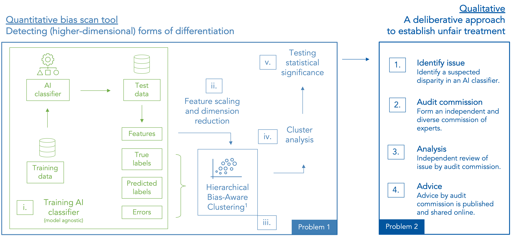

## Detecting higher-dimensional forms of proxy bias

📄 Applied in real-world audit: [audit report](https://algorithmaudit.eu/algoprudence/cases/aa202402_preventing-prejudice_addendum/)

☁️ Web app on [Algorithm Audit website](https://algorithmaudit.eu/technical-tools/bdt/#web-app)

Note: This module is still considered experimental, so conclusions drawn from the results should be carefully reviewed by domain experts. 

## Key takeaways – Why unsupervised bias detection?
- **Quantitative-qualitative joint method**: Data-driven bias testing combined with the balanced and context-sensitive judgment of human experts;
- **Normative advice commission**: Expert-led, deliberative assessment to establish unfair treatment;
- **Bias scan tool**: Scalable method based on machine learning to detect algorithmic bias;
- **Unsupervised bias detection**: No user data needed on protected attributes;
- **Detects complex bias**: Identifies unfairly treated groups characterized by mixture of features, detects intersectional bias;
- **Model-agnostic**: Works for all binary AI classifiers;
- **Open-source and not-for-profit**: Easy to use and available for the entire AI auditing community.

<!-- | **CI/CD**     | [](https://github.com/aeon-toolkit/aeon/actions/workflows/release.yml) [](https://github.com/aeon-toolkit/aeon/actions/workflows/pr_pytest.yml) [](https://github.com/aeon-toolkit/aeon/actions/workflows/periodic_tests.yml) [](https://www.aeon-toolkit.org/en/stable/) [](https://www.aeon-toolkit.org/en/latest/)| -->


|   |   |
| --- | --- |
| **Code**      | [](https://pypi.org/project/unsupervised-bias-detection/) [](https://www.python.org/) [](https://github.com/NGO-Algorithm-Audit/unsupervised-bias-detection?tab=MIT-1-ov-file#) |
| **Community** | [](https://join.slack.com/t/aa-experthub/shared_invite/zt-2n8aqry8z-lWC6XTbqVmb6S2hpkThaqQ) [](https://www.linkedin.com/company/algorithm-audit/) |


## How this tool fits in our quantitative-qualitative AI auditing framework?
The Joint Fairness Assessment Method developed (JFAM) by NGO Algorithm Audit combines data-driven bias testing with normative and context-sensitive judgment of human experts, to determine fair AI on a case-by-case basis. The data-driven component comprises this unsupervised clustering tool (available as a free-to-use [web app](https://algorithmaudit.eu/technical-tools/bdt/#web-app)) that discovers complex and hidden forms of bias. It thereby tackles the difficult problem of detecting proxy-discrimination that stems from unforeseen and higher-dimensional forms of bias, including intersectional forms of discrimination. The results of the bias scan tool serve as a starting point for a deliberative assessment by human experts to evaluate potential discrimination and unfairness in an AI system.

As an example, we applied our bias detection tool to a BERT-based disinformation classifier and distilled a set of pressing questions about its performance and possible biases. We presented these questions to an independent advice commission composed of four academic experts on fair AI, and two civil society organizations working on disinformation detection. The advice commission believes there is a low risk of (higher-dimensional) proxy discrimination by the reviewed disinformation classifier. The commission judged that the differences in treatment identified by the quantitative bias scan can be justified, if certain conditions apply. The full advice can be read in our [algoprudence case repository](https://algorithmaudit.eu/algoprudence/cases/aa202301_bert-based-disinformation-classifier/) (ALGO:AA:2023:01).

Our joint approach to AI auditing is supported by 20+ actors from the international AI auditing community, including journalists, civil society organizations, NGOs, corporate data scientists and academics. In sum, it combines the power of rigorous, machine learning-informed bias testing with the balanced judgment of human experts, to determine fair AI in a concrete way.

<sub><sup>1</sup>The bias scan tool is based on the k-means Hierarchical Bias-Aware Clustering method as described in Bias-Aware Hierarchical Clustering for detecting the discriminated groups of users in recommendation systems, Misztal-Radecka, Indurkya, _Information Processing and Management_ (2021). [[link]](https://www.sciencedirect.com/science/article/abs/pii/S0306457321000285) Additional research indicates that k-means HBAC, in comparison to other clustering algorithms, works best to detect bias in real-world datasets.</sub>

<sub><sup>2</sup>The uploaded data is instantly deleted from the server after being processed.</sub>

<sub><sup>3</sup>Real-time Rumor Debunking on Twitter, Liu et al., _Proceedings of the 24th ACM International on Conference on Information and Knowledge Management_ (2015).</sub>

## Bias detection tool manual

A .csv file of max. 1GB, with columns: features, performance metric. Note: Only the naming, not the order of the columns is of importance. The dataframe displayed in Table 1 is digestible by the [web app](https://algorithmaudit.eu/technical-tools/bdt/#web-app)

| feat_1 | feat_2 | ... | feat_n | performance metric |
|--------|--------|-----|--------|------------|
| 10     | 1      | ... | 0.1    | 1          | 
| 20     | 2      | ... | 0.2    | 1          | 
| 30     | 3      | ... | 0.3    | 0          | 


<sub>*Table 1 – Structure of input data in the bias detection tool*</sub>

Features values can be numeric or categorical values. The numeric performance metric is context-dependent. The variable can, for instance, represents being 'selected for examination' (yes or no), 'assigned to a high-risk catagory (yes or no)' or false positive (yes or no). Low scores are considered to be a negative bias, i.e., if being selected for examination is considered to be harmful, 'selected for examination=Yes' should be codified as 0 and 'selected for examination=No' should be codified as 1.

## Example – Hierarchical Bias-Aware Clustering

Note: The feature labels used in this example can easily be changed for numeric targets. This flexibility enables adaptation to detect (higher-dimensional) bias in various AI classifiers.

```python
import unsupervised-bias-detection as usb

X = [[35, 55000, 1], # age, income, number of cars
     [40, 45000, 0], 
     [20, 30000, 0]]
y = [1, 0, 0]  # flagged for fraud examination (yes:0, no:1)
hbac = BiasAwareHierarchicalKMeans(n_iter=1, min_cluster_size=1).fit(X, y)
hbac.n_clusters_
>>> 2
hbac.scores_
>>> array([ 0.5, -0.5])
```

## Schematic overview


## Contributing Members
- [Floris Holstege](https://github.com/fholstege)
- [Joel Persson](https://github.com/jopersson)
- [Jurriaan Parie](https://github.com/jfparie)
- [Kirtan Padh](https://github.com/kirtanp)
- [Krsto Proroković](https://github.com/krstopro)
- [Mackenzie Jorgensen](https://github.com/mjorgen1)

### 20+ endorsements from various parts of the AI auditing community 
#### Journalism
- Gabriel Geiger, Investigative Reporter Algorithms and Automated Decision-Making at Lighthouse Reports

#### Civil society organisations
- [Maldita](https://maldita.es/maldita-es-journalism-to-not-be-fooled/), an independent journalistic platform focused on the control of disinformation and public discourse through fact-checking and data journalism techniques
- [Demos](https://demos.co.uk/), Britain's leading cross-party think-tank
- [AI Forensics](https://www.aiforensics.org), a European non-profit that investigates influential and opaque algorithms
- [NLAIC](https://nlaic.com), The Netherlands AI Coalition
- [Progressive Café](https://progressiefcafe.nl), public platform of young Dutch intellectuals, represented by Kiza Magendane
- [Dutch AI Ethics Community](https://www.linkedin.com/company/daiec/), represented by Samaa Mohammad
- Simone Maria Parazzoli, OECD Observatory of Public Sector Innovation (OPSI)

#### Industry
- Selma Muhammad, Trustworthy AI consultant at Deloitte
- Laurens van der Maas, Data Scientist at AWS
- Xiaoming op de Hoek, Data Scientist at Rabobank
- Jan Overgoor, Data Scientist at SPAN
- Dasha Simons, Trustworthy AI consultant at IBM

#### Academia
- Anne Meuwese, Professor in Public Law & AI at Leiden University
- Hinda Haned, Professor in Responsible Data Science at University of Amsterdam
- Raphaële Xenidis, Associate Professor in EU law at Sciences Po Paris
- Marlies van Eck, Assistant Professor in Administrative Law & AI at Radboud University
- Aileen Nielsen, Fellow Law&Tech at ETH Zürich
- Vahid Niamadpour, PhD-candidate in Linguistics at Leiden University
- Ola Al Khatib, PhD-candidate in the legal regulation of algorithmic decision-making at Utrecht University

## Help and Support

This project is still in its early stages, and the documentation is a work in progress. In the meantime, feel free to open an [issue](https://github.com/NGO-Algorithm-Audit/unsupervised-bias-detection/issues), and we'll do our best to assist you.

## Contributing

Your contributions are highly encouraged! There are many opportunities for potential projects, so please reach out if you'd like to get involved. Whether it's code, notebooks, examples, or documentation, every contribution is valuable—so don’t hesitate to jump in. To contribute, simply fork the project, make your changes, and submit a pull request. We’ll work with you to address any issues and get your code merged into the main branch.