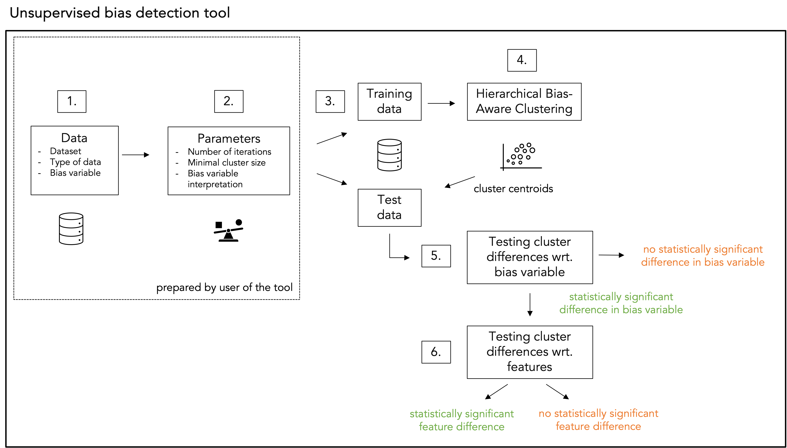
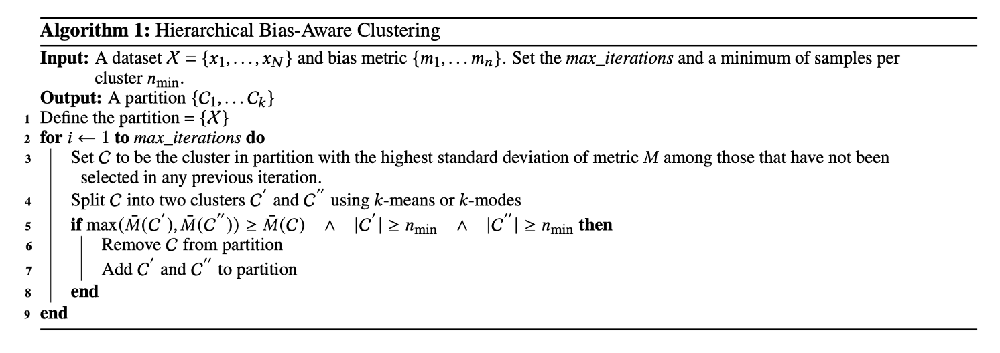

## Unsupervised bias detection

📄 Applied in real-world audit: [audit report](https://algorithmaudit.eu/algoprudence/cases/aa202402_preventing-prejudice_addendum/)

☁️ Web app on [Algorithm Audit website](https://algorithmaudit.eu/technical-tools/bdt/#web-app)

🧪 Scientific paper: [Arxiv pre-print](https://arxiv.org/pdf/2502.01713)

## Key takeaways – Why unsupervised bias detection?
- **Quantitative-qualitative joint method**: Data-driven bias testing combined with the balanced and context-sensitive judgment of human experts;
- **Unsupervised bias detection**: No data needed on protected attributes, e.g., gender or ethnicity (unsupervised learning);
- **Anolamy detection**: Scalable method based on statistical analysis;
- **Detects complex bias**: Identifies unfairly treated groups characterized by mixture of features, detects intersectional bias;
- **Model-agnostic**: Works for all algorithms and AI systems;
- **Open-source and not-for-profit**: User friendly, privacy-preserving and free to use for the entire AI auditing community.

|   |   |
| --- | --- |
| **Code**      | [](https://pypi.org/project/unsupervised-bias-detection/) [](https://www.python.org/) [](https://github.com/NGO-Algorithm-Audit/unsupervised-bias-detection?tab=EUPL-1.2-1-ov-file#readme) |
| **Community** | [](https://join.slack.com/t/aa-experthub/shared_invite/zt-2n8aqry8z-lWC6XTbqVmb6S2hpkThaqQ) [](https://www.linkedin.com/company/algorithm-audit/) |

## Installation

#### Pip

```
pip install unsupervised-bias-detection
```

#### Source

```
git clone https://github.com/NGO-Algorithm-Audit/unsupervised-bias-detection.git
cd unsupervised-bias-detection
pip install -r requirements.txt
python setup.py install
```

## Unsupervised bias detection in seven steps:

### Prepared by the user:

**Step 1. Data:**
The user should prepare the following aspects relating to the processed data:
* Dataset: The data must be provided in a tabular format. Any missing values should be removed or replaced.
* Type of data: All columns, except the bias variable column, should have uniform data types, e.g., either all numerical or all categorical. The user selects whether numerical of categorical data are processed.
* Bias variable: A column should be selected from the dataset to serve as the `bias variable`, which needs to be categorical. In step 4, clustering will be performed based on these categorical values. Examples include metrics such as "being classified as high risk", "error rate" or "selected for an investigation".

**Step 2. Hyperparameters:** 
The user shoulds set the following hyperparameters:
* Iterations: How often the data are allowed to be split in smaller clusters, by default 3 iterations are selected.
* Minimal cluster size: How many datapoints the identified clusters may contain, by deafault set to 1% of the number of rows in the attached dataset. More guidance on well-informed choice of the minimal cluster size can be found in section 3.3 of our [scientific paper](/technical-tools/bdt/#scientific-paper).
* Bias variable interpretation: How the bias variable should be interpreted. For instance, when error rate or misclassifications are chosen as the bias variable, a lower value is preferred, as the goal is to minimize errors. Conversely, when accuracy or precision is selected as the bias variable, a higher value is preferred, reflecting the aim to maximize performance.

### Performed by the tool:

**Step 3. Train-test data:**
The dataset is divided into train and test subset, following a 80-20 ratio.

**Step 4. Hierarchical Bias-Aware Clustering (HBAC):**
The HBAC algorithm (detailed below) is applied to the train dataset. The centroids of the resulting clusters are saved and later used to assign cluster labels to data points in the test dataset.

**Step 5. Testing cluster differences wrt. bias variable:** 
Statistical hypothesis testing is performed to evaluate whether the bias variable differ significantly in the most deviating cluster compared to the rest of the dataset. A one-sided Z-test is used to compare the means of the bias variable by testing the following hypothesis:

```
H_0: no difference in bias variable between the most deviating cluster and the rest of the dataset
H_A: difference in bias variable between the most deviating cluster and the rest of the dataset.
```

**Step 6. Testing cluster differences wrt. features:**
If H_0 is rejected and H_1 is accepted, i.e., a statistically significant difference in bias variable between the most deviating cluster and the rest of the dataset occurs, feature diffences between the most deviating cluster and the rest of the dataset are examined. For this, also statistical hypothesis testing is used, namely a t-test in case numercial data and Pearson’s 𝜒2-test in case categorical data are processed. For multiple hypothesis testing, Bonferonni correction is applied. Further details can be found in section 3.4 of our [scientific paper](/technical-tools/bdt/#scientific-paper).

A schematic overview of the above steps is depicted below.



#### How does the clustering algorithm work?

The *Hierarchical Bias-Aware Clustering* (HBAC) algorithm identifies clusters in the provided dataset based on a user-defined `bias variable`. The objective is to find clusters with low variation in the bias variable within each cluster. Variation in the bias variable between clusters should be high. HBAC iteratively finds clusters in the data using k-means (for numerical data) or k-modes clustering (for categorical data). For the initial split, HBAC takes the full dataset and splits it in two clusters. Cluster `C` – with the highest standard deviation of the bias variable – is selected. Then, cluster `C` is divided into two candidate clusters `C'` and `C''`'. If the average bias variable in either candidate cluster exceed the the average bias variable in `C`, the candidate cluster with highest bias variable is selected as a new cluster. This process repeats until the maximum number of iterations (`max_iterations`) is reached or the resulting cluster fails to meet the minimum size requirement (`n_min`). The pseudo-code of the HBAC algorithm is provided below.



The HBAC-algorithm is introduced by Misztal-Radecka and Indurkya in a [scientific article](https://www.sciencedirect.com/science/article/abs/pii/S0306457321000285) as published in *Information Processing and Management* in 2021. Our implementation of the HBAC-algorithm advances this implementation by proposing additional methodological checks to distinguish real singals from noise, such as sample splitting, statistical hypothesis testing and measuring cluster stability. Algorithm Audit's implementation of the algorithm can be found in the <a href="https://github.com/NGO-Algorithm-Audit/unsupervised-bias-detection/blob/master/README.md" target="_blank">unsupervised-bias-detection</a> pip package.

#### How should the results of the tool be interpreted?

The HBAC algorithm maximizes the difference in bias variable between clusters. To prevent incorrect conclusions that there are unwanted deviations in the decision-making process under review when there truly is none, we: 1) split the dataset in training and test data; and 2) test hypotheses. If a statistically significant deviation is detected, the outcome of the tool serves as a starting point for human experts to assess the identified deviations in the decision-making processes.

## Example – Hierarchical Bias-Aware Clustering

Note: The feature labels used in this example can easily be changed for numeric targets. This flexibility enables adaptation to detect (higher-dimensional) bias in various AI classifiers.

* COMPAS dataset [notebook]()

## Contributing Members
- [Floris Holstege](https://github.com/fholstege)
- [Joel Persson](https://github.com/jopersson)
- [Jurriaan Parie](https://github.com/jfparie)
- [Kirtan Padh](https://github.com/kirtanp)
- [Krsto Proroković](https://github.com/krstopro)
- [Mackenzie Jorgensen](https://github.com/mjorgen1)

### 20+ endorsements from various parts of the AI auditing community 
#### Journalism
- Gabriel Geiger, Investigative Reporter Algorithms and Automated Decision-Making at Lighthouse Reports

#### Civil society organisations
- [Maldita](https://maldita.es/maldita-es-journalism-to-not-be-fooled/), an independent journalistic platform focused on the control of disinformation and public discourse through fact-checking and data journalism techniques
- [Demos](https://demos.co.uk/), Britain's leading cross-party think-tank
- [AI Forensics](https://www.aiforensics.org), a European non-profit that investigates influential and opaque algorithms
- [NLAIC](https://nlaic.com), The Netherlands AI Coalition
- [Progressive Café](https://progressiefcafe.nl), public platform of young Dutch intellectuals, represented by Kiza Magendane
- [Dutch AI Ethics Community](https://www.linkedin.com/company/daiec/), represented by Samaa Mohammad
- Simone Maria Parazzoli, OECD Observatory of Public Sector Innovation (OPSI)

#### Industry
- Selma Muhammad, Trustworthy AI consultant at Deloitte
- Laurens van der Maas, Data Scientist at AWS
- Xiaoming op de Hoek, Data Scientist at Rabobank
- Jan Overgoor, Data Scientist at SPAN
- Dasha Simons, Trustworthy AI consultant at IBM

#### Academia
- Anne Meuwese, Professor in Public Law & AI at Leiden University
- Hinda Haned, Professor in Responsible Data Science at University of Amsterdam
- Raphaële Xenidis, Associate Professor in EU law at Sciences Po Paris
- Marlies van Eck, Assistant Professor in Administrative Law & AI at Radboud University
- Aileen Nielsen, Fellow Law&Tech at ETH Zürich
- Vahid Niamadpour, PhD-candidate in Linguistics at Leiden University
- Ola Al Khatib, PhD-candidate in the legal regulation of algorithmic decision-making at Utrecht University

## Help and Support

This project is still in its early stages, and the documentation is a work in progress. In the meantime, feel free to open an [issue](https://github.com/NGO-Algorithm-Audit/unsupervised-bias-detection/issues), and we'll do our best to assist you.

## Contributing

Your contributions are highly encouraged! There are many opportunities for potential projects, so please reach out if you'd like to get involved. Whether it's code, notebooks, examples, or documentation, every contribution is valuable—so don’t hesitate to jump in. To contribute, simply fork the project, make your changes, and submit a pull request. We’ll work with you to address any issues and get your code merged into the main branch.